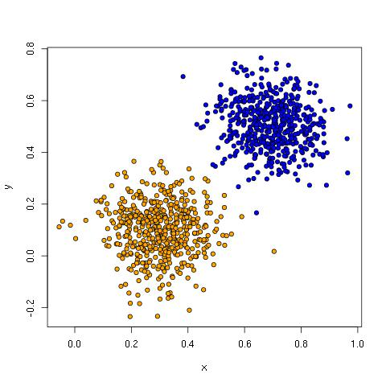
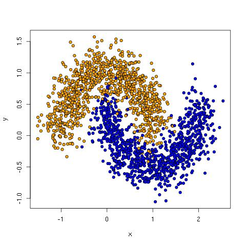
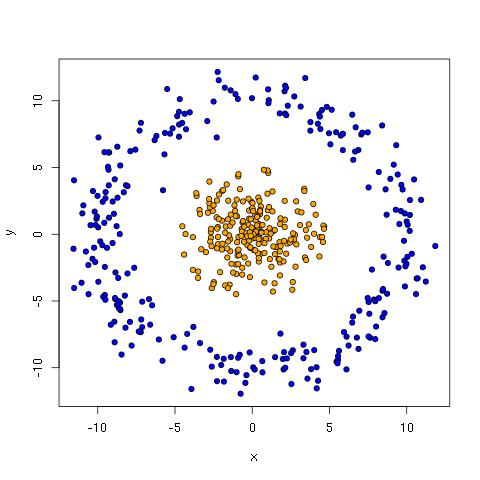

Try TensorFlow
====

Example code to try out [TensorFlow](http://www.tensorflow.org/). See the blog post [Simple end-to-end TensorFlow examples](https://bcomposes.wordpress.com/2015/11/26/simple-end-to-end-tensorflow-examples/) for more discussion and context.

You need have [TensorFlow installed](http://www.tensorflow.org/get_started/os_setup.md).

## Instructions for simulated data

The subdirectory `try-tf/simdata` contains train and evaluation data sets for three simulated data set types: linear, moon, and saturn. It also contains some simple R and Python scripts for generating and viewing the data.

### Linearly separable data

The data:

* `try-tf/simdata/linear_data_train.csv`
* `try-tf/simdata/linear_data_eval.csv`

The training data set looks like this.


  
Softmax regression is perfectly capable of handling this data. If you run the command below, you should see output similar to that provided here.

```
$ python softmax.py --train simdata/linear_data_train.csv --test simdata/linear_data_eval.csv --num_epochs 5 --verbose True
Initialized!

Training.
0 1 2 3 4 5 6 7 8 9
10 11 12 13 14 15 16 17 18 19
20 21 22 23 24 25 26 27 28 29
30 31 32 33 34 35 36 37 38 39
40 41 42 43 44 45 46 47 48 49

Weight matrix.
[[-1.87038445  1.87038457]
 [-2.23716712  2.23716712]]

Bias vector.
[ 1.57296884 -1.57296848]

Applying model to first test instance.
Point = [[ 0.14756215  0.24351828]]
Wx+b =  [[ 0.7521798  -0.75217938]]
softmax(Wx+b) =  [[ 0.81822371  0.18177626]]

Accuracy: 1.0
```

### Moon data

The data:

  * `try-tf/simdata/moon_data_train.csv`
  * `try-tf/simdata/moon_data_eval.csv`

The training data set looks like this.



The softmax network performs poorly, but a network with a five node hidden layer works great.

```
$ python softmax.py --train simdata/moon_data_train.csv --test simdata/moon_data_eval.csv --num_epochs 100
Accuracy: 0.861

$ python hidden.py --train simdata/moon_data_train.csv --test simdata/moon_data_eval.csv --num_epochs 100 --num_hidden 5
Accuracy: 0.971
```  
  
### Saturn data

The data:

  * `try-tf/simdata/saturn_data_train.csv`
  * `try-tf/simdata/saturn_data_eval.csv`

The training data set looks like this.



Again, a softmax network performs poorly, but a network with a five node hidden layer works great.

```
$ python softmax.py --train simdata/saturn_data_train.csv --test simdata/saturn_data_eval.csv --num_epochs 100
Accuracy: 0.43

$ python hidden.py --train simdata/saturn_data_train.csv --test simdata/saturn_data_eval.csv --num_epochs 100 --num_hidden 15
Accuracy: 1.0
```
  
## Generating simulated data.
  
Feel free to play around with the code to generate data to make it harder, add more dimensions, etc. You can then generate new data as follows (while in the simdata directory):
  
```
$ Rscript generate_linear_data.R
$ python  generate_moon_data.R
$ Rscript generate_saturn_data.R
```

The R scripts generate both train and test sets. For the moon data, you'll need to split the output into train and eval files using the Unix `head` and `tail` commands.

## Creating plots of the data.

To prepare the blog post for this repository, I created a few R scripts to plot data. They are simple, but I figured I'd include them in case they are useful starting points for others for changing things or plotting related data.

Go into the `simdata` directory.
  
Open `plot_data.R` in an editor and uncomment the data set you'd like to plot, save it, and then run:

```
$ Rscript plot_data.R
```

For plotting the image with the hyperplane, start up R and then provide the command `source("plot_hyperplane.R")` to R.

For plotting the graph relating the number of hidden nodes to accuracy, start up R and then provide the command `source("plot_hidden_curve.R")` to R.

